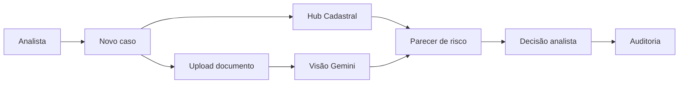
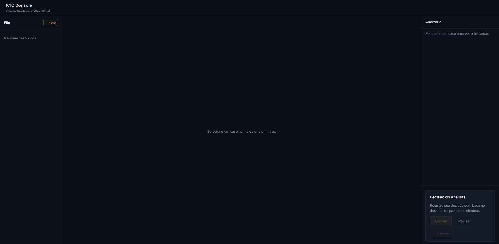
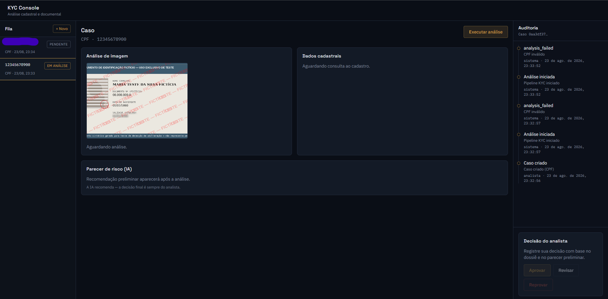

<div align="center">

# Identia

**Console de análise KYC com IA para operações de compliance**

[](https://nextjs.org/)
[](https://www.typescriptlang.org/)
[](https://react.dev/)
[](https://tailwindcss.com/)
[](https://ai.google.dev/)

Console interno que automatiza cruzamento cadastral, análise visual de documentos e parecer preliminar de risco — com decisão final sempre do analista humano e trilha completa de auditoria.

[Funcionalidades](#funcionalidades) · [Instalação](#instalação) · [Configuração](#configuração) · [Uso](#uso) · [API](#api) · [Arquitetura](#arquitetura)

</div>

---

## Sobre

**Identia** é uma plataforma de KYC (*Know Your Customer*) voltada a mesas de compliance. O analista abre casos com CPF ou CNPJ e foto do documento; o sistema consulta bases cadastrais, extrai dados via visão computacional, gera parecer de risco e registra cada etapa para auditoria.

> **Princípio central:** a IA **recomenda** — a **decisão final é sempre do analista**.

---

## Funcionalidades

- **Fila de casos** com status operacional e decisão registrada
- **Consulta cadastral** de CPF/CNPJ via Hub do Desenvolvedor
- **Análise visual** de RG, CNH e similares com Google Gemini
- **Parecer de risco** com score, sinais, justificativa e recomendação
- **Decisão do analista** — aprovar, reprovar ou solicitar revisão
- **Auditoria** com timeline de eventos por caso
- **Fallback resiliente** — degrada para regras locais se a API de IA atingir limite

---

## Fluxo



| Etapa | Descrição |
|-------|-----------|
| 1 | Analista informa CPF/CNPJ e envia foto do documento |
| 2 | Consulta cadastral retorna nome, situação e datas |
| 3 | Visão computacional extrai OCR e detecta manipulação |
| 4 | Motor de risco cruza cadastro × documento |
| 5 | Analista registra decisão final |
| 6 | Eventos ficam na trilha de auditoria |

---

## Stack

| Camada | Tecnologia |
|--------|------------|
| Frontend | Next.js 14 · React 18 · TypeScript · Tailwind CSS |
| Backend | API Routes (Next.js) |
| IA | Google Gemini |
| Cadastro | Hub do Desenvolvedor |
| Validação | Zod |
| Imagens | Sharp |
| Persistência | JSON local |

---

## 📸 Screenshots

> **Demonstração:** as informações exibidas nas imagens abaixo são **100% fictícias e foram utilizadas apenas para demonstração da interface**. Nenhum dado pessoal ou cadastral real é utilizado nas screenshots.

### Console de análise



### Análise de caso



> Os dados, documentos, nomes, números e resultados apresentados nas screenshots são fictícios e não representam pessoas ou empresas reais.

---

## Instalação

### Pré-requisitos

- Node.js 20+
- npm

### Passos

```bash
git clone https://github.com/juliosanzovo/identia.git
cd identia
npm install
cp .env.example .env.local
```

Edite `.env.local` com suas credenciais.

> **Importante:** nunca commite `.env.local` ou arquivos em `data/uploads/`.

### Desenvolvimento

```bash
npm run dev
```

Acesse **http://localhost:3000/console**

### Produção

```bash
npm run build
npm start
```

---

## Configuração

Copie `.env.example` para `.env.local` e preencha:

| Variável | Obrigatória | Descrição |
|----------|:-----------:|-----------|
| `USE_MOCKS` | Não | `true` = execução local sem APIs externas |
| `HUBDEV_API_KEY` | Sim* | Chave Hub do Desenvolvedor |
| `HUB_API_BASE_URL` | Não | URL base do Hub |
| `HUB_REQUEST_TIMEOUT_MS` | Não | Timeout em ms (padrão: `60000`) |
| `GEMINI_API_KEY` | Sim* | Chave Google Gemini |
| `GEMINI_MODEL` | Sim* | Modelo Gemini (padrão: `gemini-3.6-flash`) |
| `KYC_ANALYZER_USE_GEMINI` | Não | Usa Gemini no parecer (padrão: `true`) |

\* Não obrigatória se `USE_MOCKS=true`

---

## Uso

### Fluxo do analista

1. Clique em **Novo caso** na fila lateral
2. Selecione **CPF** ou **CNPJ**, informe o número e faça upload da foto
3. A análise inicia automaticamente após a criação
4. Revise os painéis **Cadastral**, **Visão documental** e **Parecer de risco**
5. Registre a decisão: **Aprovar**, **Reprovar** ou **Solicitar revisão**
6. Consulte a **auditoria** na coluna direita

Para reprocessar um caso, use **Reanalisar** no workspace.

### Interface

| Área | Função |
|------|--------|
| Fila | Lista de casos com status e decisão |
| Workspace | Formulário, painéis de análise e ações |
| Auditoria | Timeline + barra de decisão |

Layout em três colunas no desktop; abas no mobile.

---

## API

| Método | Rota | Descrição |
|--------|------|-----------|
| `GET` | `/api/health` | Health check |
| `GET` | `/api/cases` | Lista resumida de casos |
| `POST` | `/api/cases` | Cria caso (`multipart/form-data`) |
| `GET` | `/api/cases/:id` | Detalhe do caso |
| `POST` | `/api/cases/:id/analyze` | Executa pipeline KYC |
| `POST` | `/api/cases/:id/decide` | Registra decisão do analista |
| `GET` | `/api/cases/:id/image` | Imagem do documento |
| `GET` | `/api/audit?caseId=:id` | Auditoria do caso |

**Criar caso** — campos do `multipart/form-data`:

| Campo | Tipo | Descrição |
|-------|------|-----------|
| `documentType` | `cpf` \| `cnpj` | Tipo do documento |
| `document` | string | CPF ou CNPJ |
| `image` | file | Foto do documento |

---

## Estrutura do projeto

```
identia/
├── src/
│   ├── app/                  # App Router + API Routes
│   ├── components/console/   # UI do console
│   ├── lib/store/            # Persistência JSON
│   └── types/
├── hub-do-desenvolvedor/      # Cliente cadastral (CPF, CNPJ, CEP)
├── document-vision/          # Análise visual de documentos
├── kyc-analyzer/             # Parecer de risco
└── data/
    └── uploads/              # Imagens (runtime, não versionado)
```

Cada módulo de domínio é independente, com clientes real/offline, schemas Zod e tipos próprios, importados via path aliases no `tsconfig.json`.

---

## Arquitetura

### Pipeline (`POST /api/cases/:id/analyze`)

| # | Módulo | Responsabilidade |
|---|--------|------------------|
| 1 | `hub-do-desenvolvedor` | Valida e consulta CPF/CNPJ |
| 2 | `document-vision` | Pré-processa imagem, chama Gemini, valida JSON |
| 3 | `kyc-analyzer` | Cruza dados, aplica regras e/ou LLM |
| 4 | `src/lib/store` | Persiste resultado e auditoria |

### Sinais de risco avaliados

- Situação cadastral irregular
- Divergência de nome ou número entre cadastro e documento
- Indícios de manipulação digital
- Baixa qualidade ou confiança na extração OCR
- Empresa com menos de 6 meses (CNPJ)
- Possível foto de tela

### Decisões de design

- **Contratos tipados com Zod** — saída de IA validada antes de entrar no fluxo
- **Fallback em camadas** — quota Gemini esgotada → regras locais com confiança reduzida
- **Human-in-the-loop** — parecer nunca aprova automaticamente; só o analista decide
- **Persistência file-based** — deploy simples sem banco de dados

---

## Scripts

| Comando | Descrição |
|---------|-----------|
| `npm run dev` | Servidor de desenvolvimento |
| `npm run build` | Build de produção |
| `npm start` | Servidor de produção |
| `npm run lint` | ESLint |

---

## Segurança

Arquivos **nunca versionados** (`.gitignore`):

| Arquivo / pasta | Motivo |
|-----------------|--------|
| `.env.local` | Chaves de API |
| `data/cases.json` | Dados operacionais com PII |
| `data/audit.json` | Trilha com dados sensíveis |
| `data/hub-cache.json` | Cache cadastral |
| `data/uploads/*` | Imagens de documentos |
| `.next/` | Build cache |

**Antes de publicar no GitHub:**

1. Confirme com `git status` que `.env.local` **não aparece**
2. Não faça upload de imagens reais de documentos
3. Rotacione chaves de API se já foram expostas

---


## Status do projeto

> **Projeto descontinuado.** O desenvolvimento ativo do Identia foi encerrado e o repositório é mantido principalmente como projeto de portfólio, estudo e referência técnica.
>
> Apesar de descontinuado, o projeto pode servir como **base para uma implementação real em produção**, caso uma empresa tenha interesse em continuar seu desenvolvimento, adaptar a arquitetura e realizar as adequações necessárias ao seu ambiente, processos e requisitos de compliance.
>
> A versão atual **não deve ser considerada pronta para produção sem uma etapa de hardening, revisão de arquitetura, segurança, infraestrutura e conformidade**.

### Possíveis evoluções

Há bastante espaço para evolução do projeto. Algumas melhorias que poderiam ser implementadas em uma continuação incluem:

- **Agente de IA especializado:** opcionalmente treinar ou configurar um agente dedicado exclusivamente às tarefas de KYC, análise documental e apoio ao analista.
- **Melhoria de contexto para o modelo:** aprimorar a seleção, estrutura e quantidade de informações enviadas ao modelo para aumentar a consistência e a qualidade das análises.
- **Segurança e hardening:** proteção contra prompt injection, abuso das APIs, upload de arquivos maliciosos, exposição de dados, ataques à aplicação, rate limiting, autenticação/autorização mais robustas e demais vetores relevantes.
- **Banco de dados online:** substituir a persistência local em JSON por PostgreSQL, MySQL ou outro banco gerenciado, com backups, índices, controle de acesso e estratégia de retenção.
- **Infraestrutura de produção:** armazenamento de documentos em object storage, filas para processamento assíncrono, observabilidade, logs centralizados, monitoramento e recuperação de falhas.
- **Escalabilidade:** adaptar o pipeline para múltiplos analistas, maior volume de casos e processamento concorrente.
- **Auditoria e governança:** ampliar a trilha de auditoria, versionamento das análises, rastreabilidade das decisões e controles de acesso por função.
- **Qualidade da IA:** avaliação sistemática dos resultados, testes com datasets controlados, métricas de precisão e revisão humana contínua.
- **Conformidade:** adequação dos fluxos e da retenção de dados aos requisitos legais, regulatórios e de privacidade aplicáveis à empresa que eventualmente utilize a solução.

Esses pontos representam caminhos de evolução e **não fazem parte da implementação atual**.

---

## Licença

Projeto descontinuado e usado para fins academicos. Todos os direitos reservados.

O código pode ser utilizado como base para estudos, fork ou continuidade do desenvolvimento por uma empresa interessada, desde que sejam observadas as condições aplicáveis ao uso e que a solução passe pelas adequações necessárias antes de qualquer utilização em produção.
